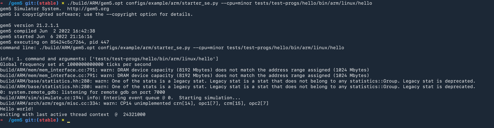
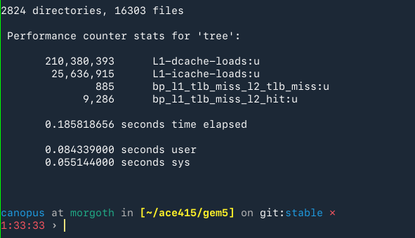

# Gem 5 Exercise - ACE415 - Computer Architecture

## Technical University of Crete

## Prof. Aggelos Ioannou

### Description

- Basics of the Gem5 CPU simulator

- Compiling and simulating a program using a variety of CPU models

- Analyzing and comparing results

### Getting Gem5

Clone the official Gem5 repo

```bash
git clone https://gem5.googlesource.com/public/gem5
```

### Building Gem5

Building and running is done using Docker. A simple Dockerfile is created containing all the dependencies for building / running (more [here](https://www.gem5.org/documentation/general_docs/building)). On top of the dependencies the Arm toolchain was installed to allow cross-compilation.

To build and drop a shell inside the container run (make sure you have Docker installed)

Clone this repo and place the `Dockerfile` and `run.sh` inside the Gem5 repo you cloned in the latter step

```bash
git clone https://github.com/the-rectifier/ace415_gem5.git
cp ace415_gem5/Dockerfile <gem5 directory>
cp ace415_gem5/run.sh <gem5 directory>
```

Inside the `gem5` directory run:

```bash
./run.sh
```

This will download an `Ubuntu 20.04` Docker Image and all dependencies `gem5` requires to be built.

After building the image you should be placed in a shell inside the container:


### Running Hello, World

```bash
./build/ARM/gem5.opt configs/example/arm/starter_se.py --cpu=minor tests/test-progs/hello/bin/arm/linux/hello
```



To build `gem5` navigate to `/gem5` inside the container and run:

```bash
scons build/ARM/gem5.opt -j $(nproc --ignore=3)
```

**Note:** From our testing PCs with <8GB Ram should build only with 2-3 threads because, the system runs out of memory due to the amount of proccesses

**Note2:** Keep in mind the above command builds `gem5` for ARM ISAs, if you want any other architecture consult the Gem5 Documentation found [here](https://www.gem5.org/documentation/general_docs/building)

### 1. Examining the config file

If we take a look at `starter_se.py` we can see the configuration of the system.

```python
cpu_types = {
    "atomic" : ( AtomicSimpleCPU, None, None, None),
    "minor" : (MinorCPU,
               devices.L1I, devices.L1D,
               devices.L2),
    "hpi" : ( HPI.HPI,
              HPI.HPI_ICache, HPI.HPI_DCache,
              HPI.HPI_L2)
```

We see that the `atomic` CPU has no cache, in contrast with the other two.

The Cache configuration is stored in another file `devices.py` and they are configured as followed:

| Cache Characteristic   | Configuration |
|:----------------------:|:-------------:|
| L1 Instruction Size    | 48KB          |
| L1 Instruction Assoc.  | 3             |
| L1 Instruction Latency | 1             |
| L1 Data Size           | 32KB          |
| L1 Data Assoc.         | 2             |
| L1 Data Write Buffers  | 16            |
| L1 Data Latency        | 2             |
| L2 Size                | 1MB           |
| L2 Assoc.              | 16            |
| L2 Write Buffers       | 16            |
| L2 Latency             | 12            |

All 3 types of cache feature a 64 byte line width (`starter_se.py:78`)

Moving a bit further down we see a configuration for the `Voltage Domain` and the `Clock Domain` (not to be confused with the CPU's Frequency)

```python
self.voltage_domain = VoltageDomain(voltage="3.3V")
        self.clk_domain = SrcClockDomain(clock="1GHz",
                                      voltage_domain=self.voltage_domain)
```

A few lines below we see the configuration for the CPU:

```python
self.cpu_cluster = devices.CpuCluster(self,
                                      args.num_cores,
                                      args.cpu_freq, "1.2V",
                                      *cpu_types[args.cpu])
```

The number of cores and frequency are defined by the user, however the Core Voltage is hardcoded at `1.2V`.

Finally in the `main()` function the user arguments are passed. With our default configuration the CPU will have the following characteristics:

| System Characteristic | Configuration |
|:---------------------:|:-------------:|
| CPU Clock             | 4GHz          |
| CPU Cores             | 1             |
| Core Voltage          | 1.2V          |
| RAM Type              | DDR3          |
| RAM Speed             | 1600MHz       |
| RAM Channels          | 2             |
| RAM Size              | 2GB           |

### 2. Analyzing Run

#### After-Run Configuration

After running a program, the emulator creates a folder called `m5out` and inside we can find the configuration used for that specific run. Examining the produced `config.ini` and `config.json` (both of them have the same information, just different structure), we can confirm:

Core Count:

```ini
[system.cpu_cluster.cpus]

type=MinorCPU

children=branchPred dcache decoder executeFuncUnits icache interrupts isa mmu power_state tracer workload

branchPred=system.cpu_cluster.cpus.branchPred

checker=Null

clk_domain=system.cpu_cluster.clk_domain

cpu_id=0
```

CPU Clock:

```ini
simFreq                                  1000000000000
...
system.cpu_cluster.clk_domain.clock               250
```

Cache Line:

```json
"cache_line_size": 64
```

Core Voltage:

```json
"voltage_domain": {
    "type": "VoltageDomain",
    "cxx_class": "gem5::VoltageDomain",
    "name": "voltage_domain",
    "path": "system.cpu_cluster.voltage_domain",
    "eventq_index": 0,
    "voltage": [
        1.2
    ]
}
```

Memory Channels:

```ini
[system.mem_ctrls0.dram]
...

[system.mem_ctrls1.dram]
...
```

#### Committed Instructions

From the `stats.txt` we find out the amount of committed instructions.

Also the amount of simulated instructions and simulated operations differ:

```
simInsts                                         5028
simOps                                           5834
```

This is because some commands are expanded into Micro-Operations.

#### Cache Statistics

From the `stats.txt` we can see that the L2 cache was accessed 7884 times with 479 of them ending with a `miss`.

Furthermore, in a typical Linux box, we can use the `perf` command to read the Performance Counters. IE: **Measuring L1 Instr, L1 Instr Loads, L1 Miss & L2 Hit and L1, L2 Miss**:

```bash
perf stat -e L1-dcache-loads -e L1-icache-loads -e bp_l1_tlb_miss_l2_tlb_miss -e bp_l1_tlb_miss_l2_hit tree
```

Each `-e` is an `event` the `perf` command keeps track of.



### 3. Writing and Testing a Custom Program

For the reference program, we wrote a really simple program that calculates the Fibonacci sum recursively. The code is really simple, yet for large numbers (>30) the complexity increases exponentially:

```c
#include <stdio.h>

int fib(int n) {
    if (n <= 1) return n;

    return fib(n-1) + fib(n-2);
}

int main() {
    int n = 30;
    printf("Fibonacci sum of %d = %d\n", n, fib(n));
    return 0;
}
```

Time to completion for each of the two models tested:

| TimingSimple CPU | Minor CPU |
|:----------------:|:---------:|
| 50.72 s.         | 145.20 s. |

`TimingSimple CPU` beats the `Minor CPU` because `Minor CPU` uses Pipeline, however without taking advantage of the highest clock speed. Basically because we do not lower the Time Period of  `Minor CPU` it ends up taking the same amount of time to finish each pipeline stage, as the `TimingSimple CPU` needs to finish a whole Instruction.

#### Adjusting CPU Clocks

In our testing we found that even if we increased the clock speed of the `MinorCPU`, even tenfold, the time taken will be the same (and vice versa, reducing the clocl speed of the `TimingSimpleCPU`).

So either the above statement regarding the Pipeline was false, or the bottleneck is somewhere else entirely, in our System prehaps.

#### Changing CPU/RAM Configuration

Following the patter from above, even if we change our RAM Configuration to the newest LPDDR5 - 6400MHz the time to completion doesn't change at all.
